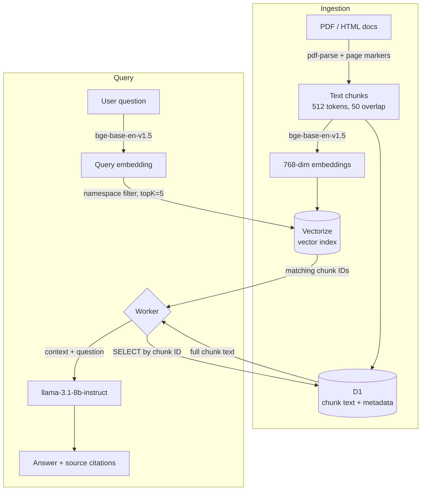

# Foster Care RAG System

A Retrieval-Augmented Generation (RAG) system for querying Texas foster care regulations, built on Cloudflare Workers with D1 and Vectorize.

## Features

- 📚 Natural language queries over foster care regulations
- 🔍 Vector semantic search with 768-dimensional embeddings
- 🎯 Namespace filtering (caseworker, foster_parent, legal, admin, general)
- 📄 PDF page anchor links in source citations
- 🔒 Authenticated document upload endpoint
- ✅ Comprehensive evaluation suite (12/13 tests passing, 93.6% source recall)

## Quick Start

### 1. Install Dependencies

```bash
npm install
```

### 2. Configure Authentication

The `/upload` endpoint requires an API key for security.

**Generate a secure key:**
```bash
openssl rand -base64 32
```

**For local development:**
```bash
cp .env.example .dev.vars
# Edit .dev.vars and set UPLOAD_API_KEY to your generated key
```

**For production:**
```bash
wrangler secret put UPLOAD_API_KEY
# Paste your generated key when prompted
```

### 3. Initialize Database

```bash
# Local
npm run db:init

# Production
npm run db:init:remote
```

### 4. Run Development Server

```bash
npm run dev
```

The worker will be available at `http://localhost:8787`

## Usage

### Query the RAG System

**Via Web UI:**
Open `http://localhost:8787` in your browser

**Via API:**
```bash
curl "http://localhost:8787/query?text=What%20are%20the%20bedroom%20requirements%20for%20foster%20children&namespace=foster_parent"
```

**Response:**
```json
{
  "answer": "According to 40 TAC Chapter 749...",
  "sources": [
    {
      "chunk_id": 123,
      "title": "Minimum Standards for Child-Placing Agencies",
      "section": "Full Chapter",
      "source_url": "https://example.com/doc.pdf",
      "regulation_type": "40 TAC Chapter 749",
      "score": 0.892,
      "page_start": 45
    }
  ]
}
```

### Upload Documents

**Via ingestion script:**
```bash
# Make sure UPLOAD_API_KEY is set in .dev.vars
npm run ingest
```

**Via API:**
```bash
curl -X POST http://localhost:8787/upload \
  -H "Content-Type: application/json" \
  -H "Authorization: Bearer YOUR_API_KEY" \
  -d '{
    "title": "Foster Home Minimum Standards",
    "regulation_type": "40 TAC Chapter 749",
    "content": "Your document content here...",
    "namespace": "foster_parent",
    "source_type": "regulation"
  }'
```

**Response:**
```json
{
  "success": true,
  "document_id": 1,
  "chunks_created": 42
}
```

## Scripts

- `npm run dev` - Start local development server
- `npm run deploy` - Deploy to Cloudflare Workers
- `npm run db:init` - Initialize local D1 database
- `npm run db:init:remote` - Initialize production D1 database
- `npm run ingest` - Ingest documents from `docs/` directory (local)
- `npm run ingest:remote` - Ingest documents to production
- `npm run eval` - Run evaluation test suite

## Project Structure

```
foster_rag/
├── src/
│   ├── index.ts          # Main Worker (endpoints)
│   ├── embeddings.ts     # Embedding generation
│   ├── chunker.ts        # Text chunking with page markers
│   ├── vectorize.ts      # Vectorize operations
│   ├── rag.ts           # Answer generation
│   └── types.ts         # TypeScript interfaces
├── scripts/
│   ├── ingest-docs.ts   # Document ingestion
│   ├── evaluate.ts      # RAG evaluation
│   └── upload-document.ts
├── public/
│   └── index.html       # Query UI
├── schema.sql           # D1 schema
└── wrangler.jsonc       # Cloudflare config
```

## Authentication

The `/upload` endpoint is protected by API key authentication:

- **No API key configured**: Warning logged, endpoint unprotected (dev mode)
- **API key configured**: Requires `Authorization: Bearer <key>` header

### Testing Authentication

```bash
# Should fail - no auth
curl -X POST http://localhost:8787/upload \
  -H "Content-Type: application/json" \
  -d '{"title":"test","regulation_type":"test","content":"test","namespace":"general"}'
# Returns: {"error":"Missing Authorization header"}

# Should fail - wrong key
curl -X POST http://localhost:8787/upload \
  -H "Content-Type: application/json" \
  -H "Authorization: Bearer wrong-key" \
  -d '{"title":"test","regulation_type":"test","content":"test","namespace":"general"}'
# Returns: {"error":"Invalid API key"}

# Should succeed - correct key
curl -X POST http://localhost:8787/upload \
  -H "Content-Type: application/json" \
  -H "Authorization: Bearer YOUR_API_KEY" \
  -d '{"title":"test","regulation_type":"test","content":"test","namespace":"general"}'
# Returns: {"success":true,"document_id":1,"chunks_created":1}
```

## Evaluation

Run the test suite to validate RAG performance:

```bash
npm run eval
```

**Current metrics:**
- ✅ 12/13 tests passing
- 📊 93.6% average source recall
- 🎯 100% namespace isolation

## Architecture



**Stack:**
- **Cloudflare Workers** - Serverless compute (Hono)
- **D1** - SQLite document store (full chunk text, primary key lookups)
- **Vectorize** - Vector index (768 dimensions, cosine similarity, namespace-filtered)
- **Workers AI** - Embeddings (`bge-base-en-v1.5`) + LLM (`llama-3.1-8b-instruct-fast`)

## Security

- 🔒 API key authentication on `/upload` endpoint
- ⚠️ `/query` endpoint is public (add auth if needed)
- 🔑 Secrets stored in Cloudflare (never in git)
- 🚫 `.dev.vars` gitignored

## Deployment

```bash
# Deploy to Cloudflare Workers
npm run deploy

# Set production secrets
wrangler secret put UPLOAD_API_KEY

# Initialize production database
npm run db:init:remote

# Ingest documents to production
WORKER_URL=https://your-worker.workers.dev UPLOAD_API_KEY=your-key npm run ingest
```

## License

MIT
